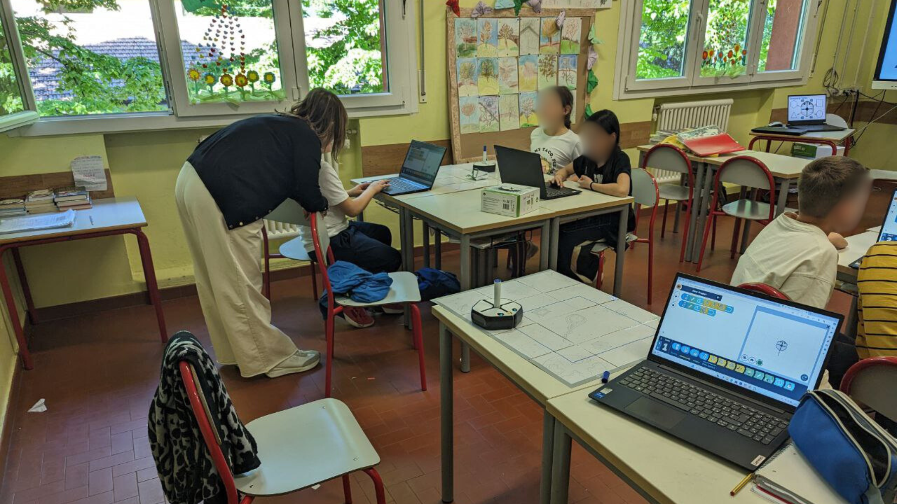

# Robotics classes in primary and middle schools

During A.S. 2022/23 and 2023/24, I taught two robotic courses in the Primary School M. Fresu (Castenaso) and middle school Maestre Pie (Bologna). In the middle school, I leveraged different robots based on the different ages, teaching the basics of coding and how to take advantage of the different robot features. In the middle school, used multiple mBot2 robots to teach students how to control them in a navigation setup, including telecomunication and optimization basics.

