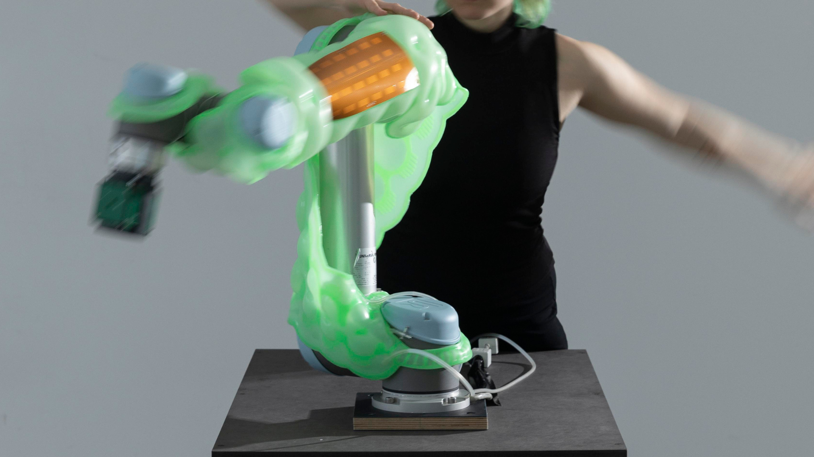

# S+T+ARTS Project - Soft Collision

**Soft Collision (2024)** looks at the potential of safe physical interaction by embracing collision rather than avoiding it. Through a deformable, pneumatic membrane that serves as a tangible interface to foster direct manipulation and live programming, making interactions more intuitive and inclusive. The collective efforts of the artist, performer, and technical specialists have been crucial in shaping this concept, to move beyond conventional industrial interaction protocols toward a more engaged and comprehensive mode of communication.

We took care of the **architectural integration** of the multiple projects' components: the robots RB-KAIROS+ (Robotnik) and UR5e (Universal Robots), the Flex-TS sensible Skin (IIT), the iCube (IIT) and the inflatable skin (Schaeffner). The system allowed artists to paint on a wall by freely moving the UR5e robot. The robots control was mediated by touches on the sensitive skin and iCube devices, also their safety was ensured by the skin insufflation.

[**More Info!**](https://anna-schaeffner.com/Soft-Collision)