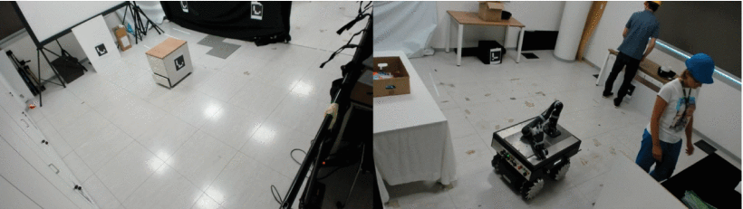
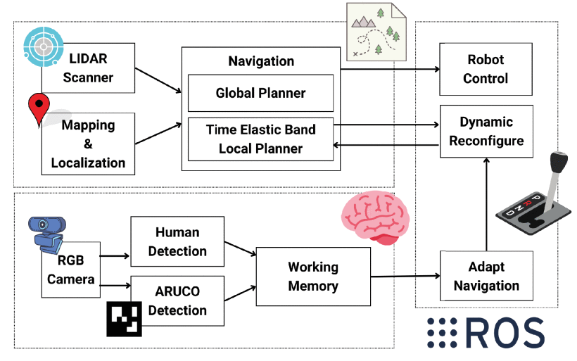

# Working Memory-based Context-Awareness for Autonomous Navigation in Industrial Settings

To enable a smooth co-existence between robots and human workers in an industrial setting, we implemented two robot working memory configurations onto a mobile manipulator RB-KAIROS+ robot (Robotnik): A GRU-based one and a bio-inspired alternative called WorkMATe which enabled the robot to adapt its navigation strategy depending on the presence of human workers. To evaluate the two working memory configurations against a non adaptive behaviour, we tested a possible co-working scenario between two ostensible workers and the RB-KAIROS+ robot navigating in two mocked industrial set-ups. The application of behavioral adaptation through a working memory component was highly beneficial as it led to reduced energy consumption and, more importantly, to fewer acceleration anomalies in robot navigation than the non adaptive one. This suggests that a robot’s adaptive navigation through working memory can increase workers’ safety and improve the efficiency of the human-robot system as a whole in industrial applications.

[**Download the Paper!**](https://ieeexplore.ieee.org/document/10309344)